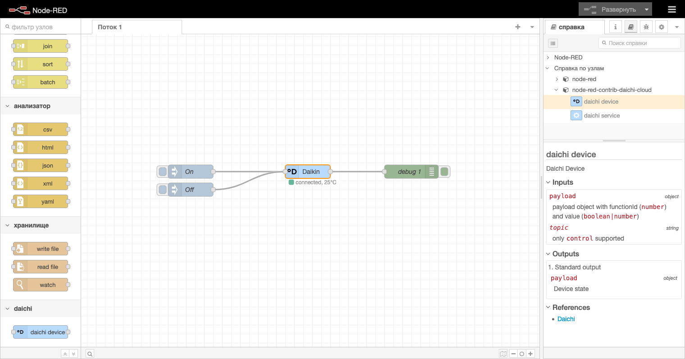

# Node-RED Daichi HVAC Control

This Node-RED module integrates with the [Daichi](https://github.com/niklv/daichi) library to provide nodes for controlling HVAC systems. This allows for easy automation and control of HVAC units within the Node-RED environment.
Supports all commands (set temp, power modes, swings, etc.) from Daichi Cloud

## Nodes

### Daichi Device

A node to control the HVAC system using the Daichi library.

#### Inputs

- payload (`object`) - payload object with functionId (`number`) and value (`boolean|number`)
- _topic_ (`string`) - only `control` supported

### Outputs

- payload (`object`) : Device state

### References

- [Daichi](https://github.com/niklv/daichi/blob/master/src/schemas/daichi.ts)
