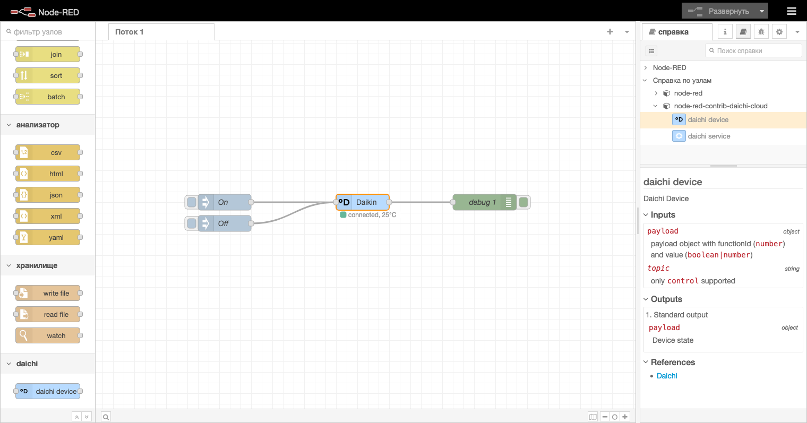

# node-red-contrib-daichi-cloud

Node-RED nodes for **Daichi Comfort Cloud** ([web.daichicloud.ru](https://web.daichicloud.ru)),
the cloud behind Daichi and Daikin Wi-Fi HVAC modules. Read the state of your air
conditioners, send them commands, and react to changes as they happen.

- Live updates over the cloud's MQTT broker, no polling.
- Every command the cloud supports: power, mode, target temperature, fan speed, swing.
- One account connection shared by every device node in your flows.



> Unofficial. Not affiliated with Daichi or Daikin. The cloud API is undocumented and may change.

## Requirements

| | |
| --- | --- |
| Node-RED | 5.0 or later |
| Node.js | 22 or later |

## Install

Use the Node-RED palette manager, or run this in your Node-RED user directory:

```sh
npm i node-red-contrib-daichi-cloud
```

## Getting started

1. Drag a **daichi device** node onto a flow.
2. Open it, add a new **Account**, and enter the e-mail and password of your Daichi account.
3. Pick your air conditioner from the **Device** list. It is filled in from the cloud.
4. Deploy. The node sends the device state right away and again on every change.

The package ships an example flow. Import it from the Node-RED menu under
**Import → Examples → node-red-contrib-daichi-cloud**.

## Nodes

### daichi device

Monitors and controls one air conditioner.

**Input**

| Field | Type | Notes |
| --- | --- | --- |
| `topic` | string | Must be `control`. Any other topic is ignored. |
| `payload.functionId` | number | The function to change. |
| `payload.value` | number or boolean | A number for value functions, a boolean for on/off functions. |

**Output**

| Field | Type | Notes |
| --- | --- | --- |
| `topic` | string | Always `device-state`. |
| `payload` | object | The device state. |

A message goes out when the flow starts, whenever the cloud pushes an update, and
after every accepted command. Cloud updates carry only the fields that changed, so
the node merges them into the last known state before sending it on.

The node status shows the connection and the current temperature. A rejected
command, an unreachable device, or a missing account is reported as a node error
that you can catch with a **catch** node.

### daichi service

A configuration node holding the credentials of one Daichi account. It logs in
once and keeps a single MQTT connection that every device node reads from.
Credentials live in Node-RED's credentials file, not in the flow.

## Sending commands

Function ids differ between models, so read them from your own device. Wire a
**debug** node to the device output and look at `payload.pult`, where every
function lists its `id`, `title` and `state`.

Turn the unit on:

```json
{ "topic": "control", "payload": { "functionId": 466, "value": true } }
```

Set the target temperature to 24°:

```json
{ "topic": "control", "payload": { "functionId": 472, "value": 24 } }
```

A typical split unit reports a dozen functions such as cooling, heating, auto, dry,
fan, quiet mode, vertical swing, comfort sleep, powerful and economy.

## Troubleshooting

| Node status | Meaning |
| --- | --- |
| `no service` | The device node has no account configured. |
| `error` | The account could not log in, or the device state could not be read. Check the error in the debug sidebar. |
| `disconnected, 21℃` | The air conditioner itself is offline. The cloud still reports its last temperature. |

Set `DEBUG=daichi` in the Node-RED environment to log every cloud response.
Access tokens and passwords are masked.

## Development

```sh
npm test          # unit tests against an in-process Node-RED
npm run lint      # oxlint, type-aware (npm run lint:fix to autofix)
npm run fmt       # oxfmt (npm run fmt:check in CI)
npm run typecheck # tsc --noEmit
npm run build     # bundles both nodes into build/
```

Each node lives in `src/nodes/<node>` as a runtime half (`index.ts`), an editor
half (`editor.ts`) and its edit dialog (`editor.html`). The build bundles the
runtime as an ES module for the Node-RED server and inlines the editor script
into `build/<node>.html` for the browser.

## References

- [daichi](https://github.com/niklv/daichi) - the cloud client these nodes use
- [Node-RED](https://nodered.org)

## License

MIT
